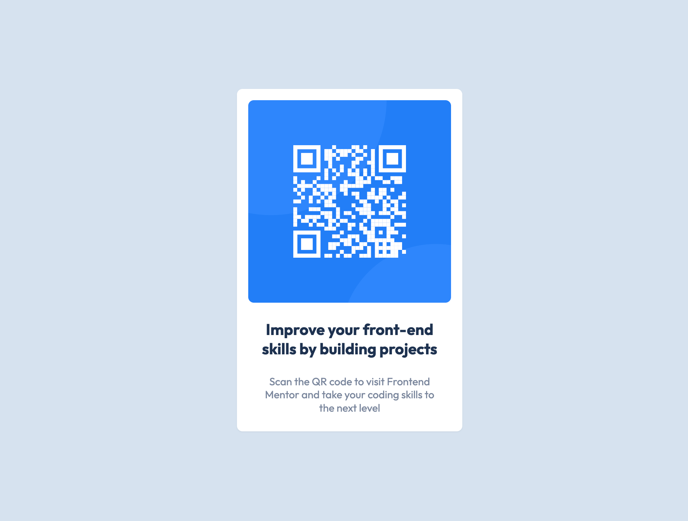

# Frontend Mentor - QR code component solution

This is a solution to the [QR code component challenge on Frontend Mentor](https://www.frontendmentor.io/challenges/qr-code-component-iux_sIO_H). Frontend Mentor challenges help you improve your coding skills by building realistic projects. 

## Table of contents

- [Overview](#overview)
  - [Screenshot](#screenshot)
  - [Links](#links)
- [My process](#my-process)
  - [Built with](#built-with)
  - [What I learned](#what-i-learned)
  - [Continued development](#continued-development)
  - [Useful resources](#useful-resources)
- [Author](#author)

## Overview

### Screenshot




### Links

- Solution URL: https://github.com/abhi02495/001_QRCode
- Live Site URL: https://abhi02495.github.io/001_QRCode/

## My process

### Built with

- HTML
- Tailwind CSS 

### What I learned

Use this section to recap over some of your major learnings while working through this project. Writing these out and providing code samples of areas you want to highlight is a great way to reinforce your own knowledge.

To see how you can add code snippets, see below:

```html
<div class="flex items-center justify-center h-screen">
    <div class="bg-white h-auto w-80 rounded-lg shadow-sm">
      <div class="m-4 rounded-lg overflow-hidden"> <!-- overflow-hidden is required when rounding the images inside a container div to ensure that container box is rounded else 
      internal items won't look rounded-->
        
      </div>
      
      <p class="text-center px-4 py-2 font-outfit font-bold text-heading text-dark_blue leading-tight">Improve your front-end skills by building projects</p>
      <p class="text-center px-8 py-4 font-outfit text-grayish_blue leading-tight text-default mb-2">Scan the QR code to visit Frontend Mentor and take your coding skills to the next level</p>
    </div>
  </div>
```

### Continued development

To practice more with Tailwind CSS and the responsive design.

### Useful resources

- [Tailwind CSS Documentation](https://tailwindcss.com/docs/installation) - This helped me in building CSS components easily.

## Author

- LinkedIn - [Abhishek](https://www.linkedin.com/in/abhishek-shubham-634101126/)
- Frontend Mentor - [@abhi02495](https://www.frontendmentor.io/profile/abhi02495)


